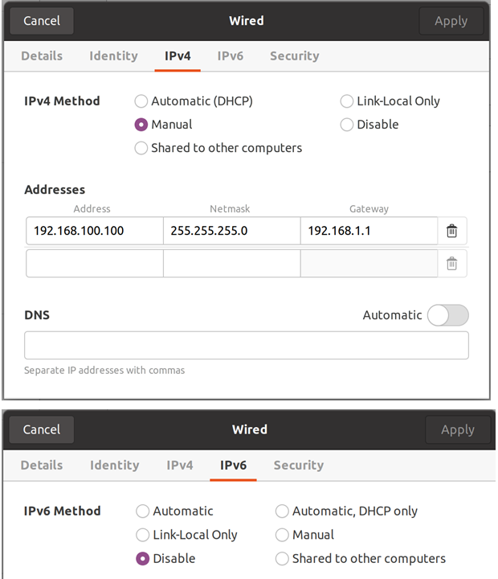
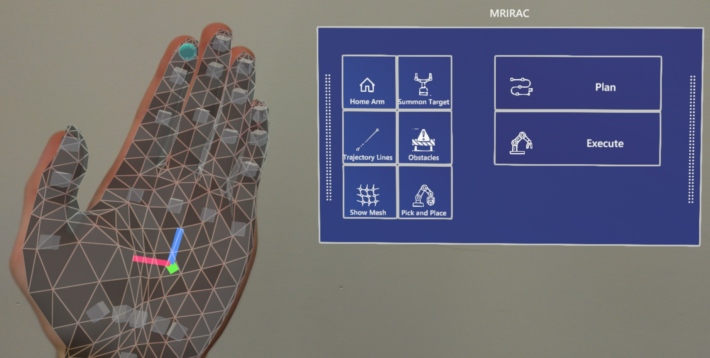
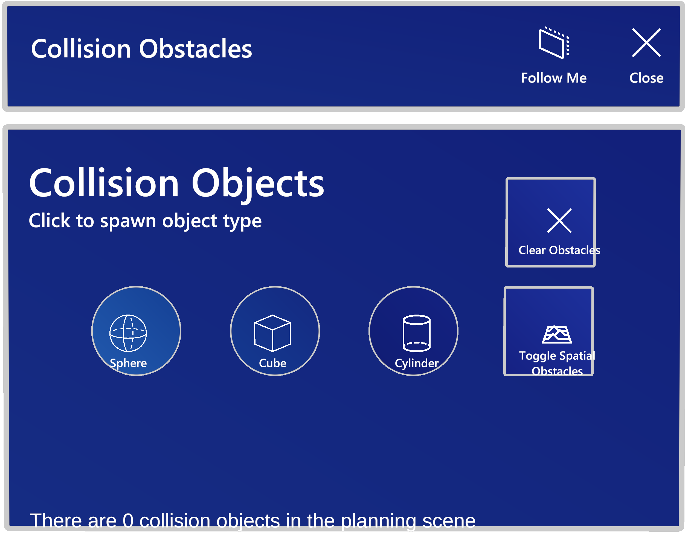
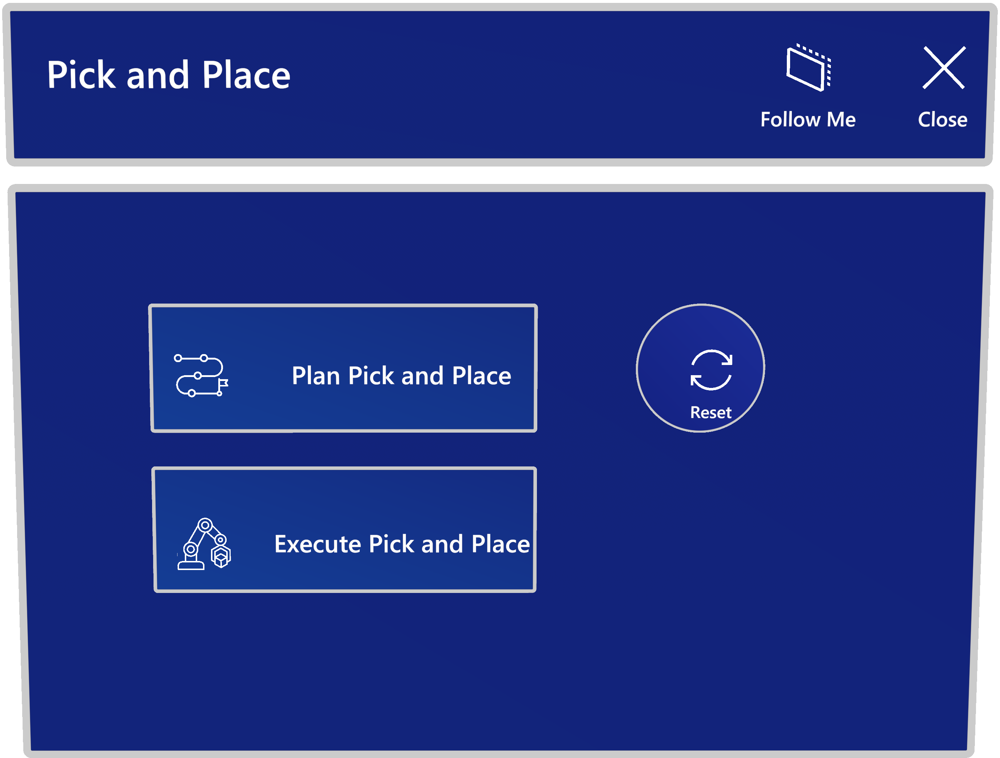

# 3D Vision Project README.md Update

This repo is a fork of the original mixed-reality-robot-arm-control-demo repo. Here we added and changed some things for our 3D Vision course project. Please follow the [Setup steps](#setup). The report is also in this repository [report](Final_Report__3DV_Autonomous_Data_Collection_for_Surgical_Procedures.pdf)

[](https://youtu.be/wjF8KKtaHz8)   [](https://youtu.be/6sPL96CTOs0)

The left video uses the Obstacle detection node while the right uses 
## Setup
1. Setup a ROS noetic workspace with following [guide](http://wiki.ros.org/catkin/Tutorials/)
2. In the src/ folder of a new or existing catkin_ws, clone this repository
3. Clone the following repositories into the same catkin_ws
```
cd ~/catkin_ws/src
git clone https://github.com/Divepit/kinova-ros.git
git clone https://github.com/Divepit/3d-vision-sugical-data-collection-interaction-package.git
git clone https://github.com/Divepit/3d-vision-sugical-data-collection-vision-package.git
```
4. Make sure you have [rosdep](http://wiki.ros.org/rosdep) installed and configured and use it to install the required dependencies
```
cd ~/catkin_ws
rosdep install --from-paths src --ignore-src -r -y
```
5. Run the following command to install missing dependencies for the controllers:
```
sudo apt-get install ros-noetic-moveit ros-noetic-trac-ik-kinematics-plugin ros-noetic-ros-control ros-noetic-ros-controllers

pip install -U scikit-learn

pip install numpy -U
```
Note: If the controller does not work the following package might help:
```
sudo apt-get install ros-noetic-pr2-arm-kinematics
```
6. Build and source the workspace with `catkin build && source devel/setup.bash`. When building for the first time or after a clean please perform this step [First Time Build](#first-time-build)

7. You can now launch the Gazebo simulation using `roslaunch mrirac 3d_vision_project.launch`.
 
 In case the of problems please refer to [Possibel Issues](#possible-issues) or check the [Interaction Package](https://github.com/Divepit/3d-vision-sugical-data-collection-interaction-package/tree/master) README.
 
## Controls during the Simulation
### Optional Packages
To easily call services, it is easiest if you use rqt. To install rqt use the following command:

```sh
sudo apt-get install ros-noetic-rqt-common-plugins
```

In order to easily call services, first start the whole pipeline and once the rosmaster is running, open rqt as follows:

```sh
rosrun rqt_service_caller rqt_service_caller
```
### Change Target Coordinates
To call the `change_target_coordinate` service and update the target coordinate, use the following command:
   
```bash
rosservice call /change_target_coordinate "{new_coordinate: {x: 4.0, y: 0.0, z: 1.75}}"
```

Adjust the `x`, `y`, and `z` values as needed.

  The service should respond with a success message, indicating that the target coordinate has been updated.

### Update Voxel Dome Service

The node provides a service named /update_voxel_dome that allows you to update the parameters of the voxel dome. The service takes the following arguments:

* `radius` (float64): The radius of the half-dome.
* `voxel_count` (int32): The number of voxels filling the half-dome.
* `scaling_factor` (float64): A factor to scale the size of the individual voxels. A value less than `1.0` will create space between the voxels.

The service returns a boolean success indicating if the operation was successful and a message providing additional information about the result.

#### Usage

After starting the Voxel Dome Generator node, you can call the /update_voxel_dome service using the rosservice command-line tool. Here's an example:

``` bash
rosservice call /update_voxel_dome "radius: 2.0
voxel_count: 200
scaling_factor: 0.9"
```

This command updates the voxel dome's radius to `2.0`, the number of voxels to `200`, and sets the scaling factor to `0.9`, which will result in smaller voxels with more space between them.

You can adjust these values as needed to generate a voxel dome with the desired size and density.

### Sphere Obstacle Publisher Node

Four different obstacle behaviours can be set in the `config.yaml` file:
``` yaml
use_dynamic_obstacle: boolean

replan_trigger_obstacle: boolean
replan_trigger_interval: int [s]

replan_trigger_square: boolean
replan_trigger_square_bound_x: float
replan_trigger_square_bound_y: float
replan_trigger_square_offset_z: float
```

1. If all booleans are set to false, the obstacle locations can be changes using the `change_obstacles` service.
2. If only `use_dynamic_obstacle` is set to true, a sphere circling about the target is rendered into simulation.
3. If only `replan_trigger_obstacle` is set to true, every `replan_trigger_interval` seconds, an obstacle between the current camera and target position is rendered.
4. If only `replan_trigger_square` is set to true, a sphere will be rendered `replan_trigger_square_offset_z` above the target in a square with bounds `replan_trigger_square_bound_x` and `replan_trigger_square_bound_y`.

### Change Obstacles Service
To change the obstacles, call the `change_obstacles` service with a list of `Sphere` messages. Here's an example of how to call the service using the `rosservice` command-line tool:

``` bash
rosservice call /change_obstacles "obstacles: {spheres: [{center: {x: 2.0, y: 0.0, z: 1.0}, radius: 0.125}, {center: {x: 2.0, y: 1.0, z: 1.0}, radius: 0.125}]}"
```

This command updates the list of obstacles with two spheres. The first sphere has its center at `(2.0, 0.0, 1.0)` and a radius of `0.125`. The second sphere has its center at `(2.0, 1.0, 1.0)` and a radius of `0.125`.

You can also change the obstacles programmatically in another ROS node by creating a client for the `change_obstacles` service and sending the new list of spheres.


## Debug C++ and Python with VSCode
install VSCode extension ROS (id: ms-iot.vscode-ros)

in the .vscode folder create a launch.json file and add following code:
```
{
    // Use IntelliSense to learn about possible attributes.
    // Hover to view descriptions of existing attributes.
    // For more information, visit: https://go.microsoft.com/fwlink/?linkid=830387
    "version": "0.2.0",
    "configurations": [
        
        {
            "name": "ROS: Attach",
            "request": "attach",
            "type": "ros"
        }
    ]
 }
```

ROS has to be running to start debugging.

open the Run and Debug menue and run "ROS: Attach". Select the language and the process you want to debug


Additional information under: https://github.com/ms-iot/vscode-ros/blob/master/doc/debug-support.md#launch

## Possible Issues

### Catkin Build Brror
The following error can appear when running ```catkin build``` and using different python versions:

```
Errors     << catkin_tools_prebuild:cmake /home/colin/3dVision/visionPipeline/logs/catkin_tools_prebuild/build.cmake.000.log
CMake Error at /opt/ros/noetic/share/catkin/cmake/empy.cmake:30 (message):
  Unable to find either executable 'empy' or Python module 'em'...  try
  installing the package 'python3-empy'
Call Stack (most recent call first):
  /opt/ros/noetic/share/catkin/cmake/all.cmake:164 (include)
  /opt/ros/noetic/share/catkin/cmake/catkinConfig.cmake:20 (include)
  CMakeLists.txt:4 (find_package)
```
The following build flag may solve the problem:
```
catkin build -DPYTHON_EXECUTABLE=/usr/bin/python3 -DPYTHON_INCLUDE_DIR=/usr/include/python3.7m
```

### First Time Build 

If an error like the following appears when running `catkin build`:

```bash
fatal error: sdc_interaction/UpdateVoxelDome.h: No such file or directory
    5 | #include <sdc_interaction/UpdateVoxelDome.h>

```

It is necessary to go into the file `CMakeLists.txt` and comment out the following two lines:

```cmake
add_executable(voxel_dome_generator_node src/voxel_dome_generator_node.cpp)
target_link_libraries(voxel_dome_generator_node ${catkin_LIBRARIES})

```

Once they are commented out, run `catkin build` again. If it is successful, uncomment the two lines again and re-run `catkin build`. There was no better fix found for this so far.


## Launchfile Update 

The launchfile used for our project can be accessed as follows:

```sh
roslaunch mrirac 3d_vision_project.launch
```

The launchfile simply launches the old launchfiles which have been used in the original mixed-reality-robot-arm-control-demo repo as well as our new launchfiles for the vision and interaction packages.

### Bash script for launching
Create in the workspace folder a NAME.sh file and paste the following lines into it
```
#!/bin/bash

catkin build
source devel/setup.bash
roslaunch mrirac 3d_vision_project.launch
```
Launch the script with
```
bash NAME.sh
```

# Original README.md 
## Mixed Reality Industrial Robot Arm Control

Programming industrial robot arms can be a tedious and unintuitive process with conventional control methods, such as joysticks or 2D GUIs.

This repository contains both a Unity application and ROS packages that enable users to control a Kinova Jaco 2 robot arm using the Microsoft HoloLens 2 through a Mixed Reality experience. Besides being able to intuitively set pose targets for the robot directly in task space, there is also a demonstration for planning a simple pick and place task. Furthermore, the application utilizes the spatial awareness capabilities of the HoloLens 2 to provide information on obstacles that are in the robot workspace, enabling collision-aware motion planning of robot movements.
## Installation
### Hardware
Required hardware:
* Kinova Jaco 2 Robot
* Microsoft HoloLens 2
* External PC (Ubuntu 20.04)
* Printed QR codes for robot localization and object detection

#### Kinova Jaco 2 Robot
1. Mount the robot securely to a flat surface
2. Connect the power cable and the controller to the robot
3. Power on the robot and send the arm to the home position by holding the middle button on the controller

#### Microsoft HoloLens 2
Make sure the HoloLens 2 device is in [developer mode](https://learn.microsoft.com/en-us/windows/mixed-reality/develop/advanced-concepts/using-visual-studio?tabs=hl2#enabling-developer-mode). This is required in order to deploy the Unity application to the device.

#### External PC (Ubuntu 20.04)
As the robot arm does not have an internal computer capable of running the ROS components, a separate machine is required. This machine can be anything capable of running Ubuntu 20.04, such as an Intel NUC or a laptop. Note that running WSL2 on Windows also works but to our knowledge only when using the Kinova Arm in the Gazebo simulation. The Kinova Ethernet/USB integration to WSL is non-trivial though.

##### Ethernet Connection
Connect the Ethernet cable to the port on the robot and to a port on the PC. So that the PC can connect to the robot driver via the Ethernet connection, the wired connection has to be configured in the following way:




##### ROS
This project was developed using ROS Noetic. It may work with other ROS releases, but it is recommended to set up a Noetic environment on the external PC, using these [instructions](http://wiki.ros.org/noetic/Installation/Ubuntu).

#### QR Codes
Print out the [QR codes](doc/images/qr_codes/) used for robot and object localization. Generally, the detection improves with increased QR code size.

Place the QR code for robot localization on the flat surface that the robot is fixed to. When starting the application for the first time, detect the QR code by looking directly at it and the robot model should appear next to it. Move the QR code until the holographic robot model lines up with the real robot. You can then fix the QR code to the surface with tape.

The object used for the Pick and Place demo also requires a QR code to be attached, so that the HoloLens can localize it. The object used in the demo videos is a cylinder with a diameter of 7.5cm and a height of 13cm. Attach the QR code to the top of the cylinder as centrally as possible.

### Unity
1. Clone this repository and open the MRIRAC_Unity folder from the Unity Hub (tested with Unity 2020.3.40f1 - we suggest using this exact Unity version, as version up/down-grades sometimes break Unity projects)
2. In the Unity editor, open the ROS Settings from the Robotics menu and set the ROS IP Address to the IP of the external machine connected to the robot arm.
3. Build and deploy the application to your HoloLens 2 device, following these [instructions](https://learn.microsoft.com/en-us/windows/mixed-reality/develop/unity/build-and-deploy-to-hololens) 
### ROS
1. In the src/ folder of a new or existing catkin_ws, clone this repository
2. Clone the following repositories into the same catkin_ws
```
cd ~/catkin_ws/src
git clone https://github.com/Divepit/kinova-ros.git
git clone https://github.com/Unity-Technologies/ROS-TCP-Endpoint.git
```
3. Open `kinova-ros/kinova_bringup/launch/config/robot_parameters.yaml` in your favorite text editor, and change the `connection_type` parameter from `USB` to `Ethernet` (line 13)
4. Make sure you have [rosdep](http://wiki.ros.org/rosdep) installed and configured and use it to install the required dependencies
```
cd ~/catkin_ws
rosdep install --from-paths src --ignore-src -r -y
```
5. Run the following command to install missing dependencies for the controllers:
```
sudo apt-get install ros-noetic-moveit ros-noetic-trac-ik-kinematics-plugin ros-noetic-ros-control ros-noetic-ros-controllers

pip install -U scikit-learn

pip install numpy -U
```
Note: If the controller does not work the following package might help:
```
sudo apt-get install ros-noetic-pr2-arm-kinematics
```
6. Build and source the workspace with `catkin build && source devel/setup.bash`
7. Test the setup by running `roslaunch mrirac kinova_real.launch` or alternatively (if you don't have a Kinova arm available or setup) you can launch the Gazebo simulation using `bash MRIRAC_ROS/mrirac/launch_sim.bash`.
 
If the robot is connected correctly and the setup was successful, you should be able to set a pose goal using the rviz interface and the robot will move to that position once `plan and execute` is pressed.

## Debug C++ and Python with VSCode
install VSCode extension ROS (id: ms-iot.vscode-ros)

in the .vscode folder create a launch.json file and add following code:
```
{
    // Use IntelliSense to learn about possible attributes.
    // Hover to view descriptions of existing attributes.
    // For more information, visit: https://go.microsoft.com/fwlink/?linkid=830387
    "version": "0.2.0",
    "configurations": [
        
        {
            "name": "ROS: Attach",
            "request": "attach",
            "type": "ros"
        }
    ]
 }
```

ROS has to be running to start debugging.

open the Run and Debug menue and run "ROS: Attach". Select the language and the process you want to debug


Additional information under: https://github.com/ms-iot/vscode-ros/blob/master/doc/debug-support.md#launch

## Possible Issues

### Catkin build error
The following error can appear when running ```catkin build``` and using different python versions:

```
Errors     << catkin_tools_prebuild:cmake /home/colin/3dVision/visionPipeline/logs/catkin_tools_prebuild/build.cmake.000.log
CMake Error at /opt/ros/noetic/share/catkin/cmake/empy.cmake:30 (message):
  Unable to find either executable 'empy' or Python module 'em'...  try
  installing the package 'python3-empy'
Call Stack (most recent call first):
  /opt/ros/noetic/share/catkin/cmake/all.cmake:164 (include)
  /opt/ros/noetic/share/catkin/cmake/catkinConfig.cmake:20 (include)
  CMakeLists.txt:4 (find_package)
```
The following build flag may solve the problem:
```
catkin build -DPYTHON_EXECUTABLE=/usr/bin/python3 -DPYTHON_INCLUDE_DIR=/usr/include/python3.7m
```


## Usage
This section aims to provide a brief guide on how to use the core functions of the Mixed Reality experience.

A collection of demonstrations is available here: https://youtube.com/playlist?list=PLihM5VMGCK942veA_fDujf4P7h3gCeHFv

### Starting the Applications
#### External PC
Start the ROS components:
```
roslaunch mrirac kinova_real.launch
```
#### HoloLens
From the Application Menu, start the `MRIRAC` app

### Hand Menu UI


* **Home Arm**: Send arm to 'Home' position
* **Summon Target**: Summon pose target hologram
* **Trajectory Lines**: Toggle display of trajectory lines
* **Obstacles**: Open Collision Obstacle UI
* **Show Mesh**: Toggle display of spatial awareness mesh
* **Pick and Place**: Open Pick and Place UI

### Sending Robot to a Target Pose
https://user-images.githubusercontent.com/48822654/217340937-584c06a8-cff5-4365-ae4e-be78d66b367a.mp4

### Collision Obstacle UI



* **Sphere**: Instantiate a spherical hologram obstacle
* **Cube**: Instantiate a cubic hologram obstacle
* **Cylinder**: Instantiate a cylindrical hologram obstacle
* **Clear Obstacles**: Remove all obstacles from the planning scene
* **Toggle Spatial Obstacles**: Toggle transmission of spatial awareness mesh information

https://user-images.githubusercontent.com/48822654/217341050-a7dd433c-f838-47ca-af97-89ff8a9c1102.mp4

https://user-images.githubusercontent.com/48822654/217341097-46c50b44-8e57-4228-8b9d-82c9a70898a5.mp4

### Pick and Place UI



* **Plan Pick and Place**: Plan pick and place mission
* **Execute Pick and Place**: Execute planned pick and place mission
* **Reset**: Reset detection of pick target (removes added obstacle)

https://user-images.githubusercontent.com/48822654/217341190-aaafd8b8-9d07-454b-926e-0d94b50aba9a.mp4

## Credits
This project was developed as part of the Semester Thesis for my (Matthew Hanlon) MSc. Robotics, Systems and Control at ETH Zurich. The project was supervised by Eric Vollenweider (Microsoft Mixed Reality and AI Lab Zurich), in collaboration with the [Computer Vision and Geometry Group](https://cvg.ethz.ch/).

# Trademark Notice
Trademarks This project may contain trademarks or logos for projects, products, or services. Authorized use of Microsoft trademarks or logos is subject to and must follow Microsoft’s Trademark & Brand Guidelines. Use of Microsoft trademarks or logos in modified versions of this project must not cause confusion or imply Microsoft sponsorship. Any use of third-party trademarks or logos are subject to those third-party’s policies.
